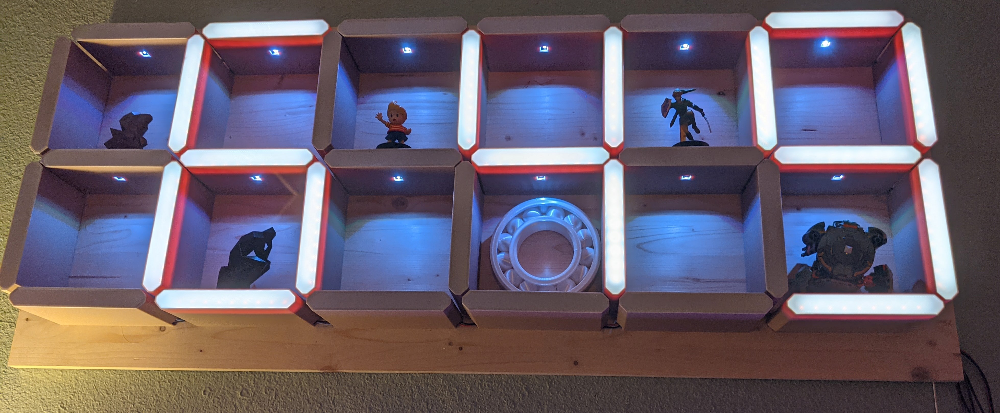

Shelf.Pi
========
This project runs the 3d Printed Shelf clock in my office.

The project is broken down into 3 C# projects:
- **Shelf.Pi.Core**  
All logic is implemented here with the exception of any logic for controlling the actual lights. An interface `ILightController` is provided to abstract out controlling the actual LEDs for the shelf.
- **Shelf.Pi.App**  
A systemd service that runs on a Raspberry Pi. This also contains an implementation of `ILightController` that uses the `Iot.Device.Bindings` Nuget package to control a Ws2812b light strip.
- **Shelf.Pi.Emulator**  
A WPF app that contains an implementation of `ILightController` that uses a WPF app to "emulate" the shelf.

